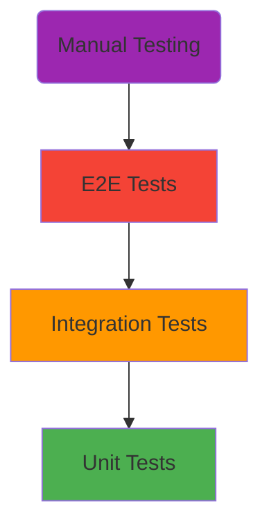
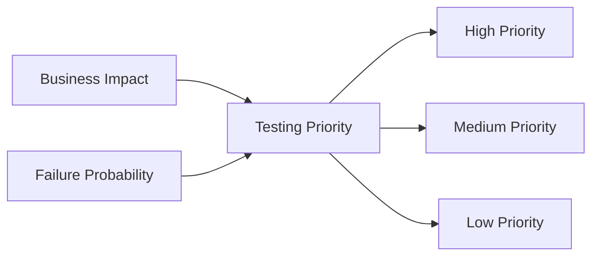
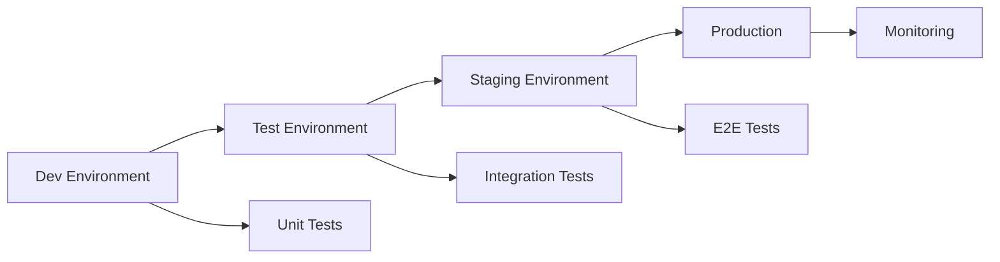

# Testing Strategy

A well-defined testing strategy is crucial for building reliable software. This guide covers how to develop and implement an effective testing strategy for your projects.

## The Testing Pyramid

The testing pyramid is a fundamental concept that guides how you should distribute your testing effort:



### Pyramid Levels

1. **Unit Tests (Base)**: Fast, isolated, numerous
2. **Integration Tests (Middle)**: Component interactions, moderate quantity
3. **E2E Tests (Top)**: Full workflows, fewer but critical
4. **Manual Testing (Peak)**: Exploratory, usability, edge cases

## Strategic Principles

### 1. Test Early and Often

- **Shift Left**: Move testing earlier in the development cycle
- **Continuous Testing**: Integrate testing into CI/CD pipelines
- **Fast Feedback**: Tests should provide quick results

### 2. Risk-Based Testing

Focus testing effort on areas with highest risk:



#### Risk Assessment Matrix

| Component | Business Impact | Failure Probability | Priority |
|-----------|----------------|-------------------|----------|
| Payment System | High | Medium | **Critical** |
| User Authentication | High | Low | **High** |
| Logging | Low | High | **Medium** |
| UI Themes | Low | Low | **Low** |

### 3. Coverage Goals

Set realistic coverage targets:

- **Unit Tests**: 80-90% line coverage
- **Integration Tests**: Critical paths and interfaces
- **E2E Tests**: Main user journeys (20% effort, 80% value)

## Test Strategy Framework

### 1. Analysis Phase

**Understand the System:**
- Architecture and components
- User workflows and use cases  
- Integration points
- Performance requirements
- Security considerations

**Risk Assessment:**
- Identify high-risk areas
- Consider failure impact
- Evaluate change frequency

### 2. Planning Phase

**Define Test Scope:**
```yaml
# Test Strategy Document
project: MyApplication
test_levels:
  unit:
    coverage_target: 85%
    frameworks: [pytest, jest]
  integration:
    focus: [api_endpoints, database_operations]  
    tools: [postman, testcontainers]
  e2e:
    critical_paths: [user_registration, checkout, payment]
    tools: [playwright, cypress]
```

**Resource Allocation:**
- 60% Unit Tests
- 25% Integration Tests  
- 15% E2E Tests

### 3. Implementation Phase

**Test Environment Strategy:**


**Test Data Management:**
- Synthetic test data
- Data masking for production-like data
- Test data refresh strategies

### 4. Execution Phase

**Continuous Integration:**
```yaml
# Example CI Pipeline
stages:
  - unit_tests:
      run: pytest
      fail_fast: true
  - integration_tests:
      run: pytest tests/integration/
      requires: [database, api_services]
  - e2e_tests:
      run: playwright test
      requires: [staging_environment]
      parallel: true
```

## Testing Methodologies

### Test-Driven Development (TDD)

The Red-Green-Refactor cycle:

1. **Red**: Write a failing test
2. **Green**: Write minimum code to pass
3. **Refactor**: Improve code while keeping tests green

```python
# Example TDD Cycle
def test_user_registration():
    # Red: This test will fail initially
    user = User.register("john@example.com", "password123")
    assert user.is_active == True

# Write implementation to make test pass (Green)
# Then refactor for better design
```

### Behavior-Driven Development (BDD)

Focus on behavior rather than implementation:

```gherkin
Feature: User Registration
  Scenario: Successful user registration
    Given I am on the registration page
    When I fill in valid user details
    And I click the register button
    Then I should see a confirmation message
    And I should receive a welcome email
```

### Risk-Based Testing

Prioritize testing based on risk analysis:

1. **Identify Risks**: Technical, business, project risks
2. **Assess Impact**: What happens if this fails?
3. **Evaluate Probability**: How likely is failure?
4. **Prioritize Testing**: Focus on high-risk areas

## Quality Gates

Define clear quality criteria:

### Code Quality Gates
- ✅ All unit tests pass
- ✅ Code coverage > 80%
- ✅ No critical security vulnerabilities
- ✅ Performance benchmarks met

### Release Quality Gates
- ✅ All integration tests pass
- ✅ Critical E2E scenarios pass
- ✅ Load testing criteria met
- ✅ Security scanning complete

## Metrics and KPIs

Track testing effectiveness:

### Process Metrics
- **Test Execution Time**: How long do tests take?
- **Test Coverage**: How much code is tested?
- **Defect Detection Rate**: Tests finding bugs vs. production bugs
- **Test Maintenance Effort**: Time spent maintaining tests

### Quality Metrics
- **Defect Density**: Bugs per lines of code
- **Escape Rate**: Production bugs not caught by tests
- **Mean Time to Recovery**: How quickly can you fix issues?

## Common Pitfalls

### ❌ Over-Testing
- Testing getters/setters
- Testing framework code
- 100% coverage obsession

### ❌ Under-Testing
- Skipping edge cases
- Ignoring error scenarios
- No integration testing

### ❌ Wrong Test Types
- E2E tests for unit-level validation
- Unit tests for integration scenarios
- Manual testing for repetitive tasks

## Best Practices

### ✅ Test Strategy Documentation
Maintain a living document that includes:
- Testing approach and rationale
- Tool selection and justification
- Coverage targets and metrics
- Risk assessment and mitigation

### ✅ Regular Strategy Reviews
- Quarterly strategy assessment
- Adjust based on project evolution
- Learn from production issues
- Update tools and practices

### ✅ Team Alignment
- Shared understanding of strategy
- Clear roles and responsibilities
- Regular training and knowledge sharing
- Collaborative test planning

!!! success "Remember"
    A good testing strategy is not set in stone. It should evolve with your project, team, and understanding of the system.