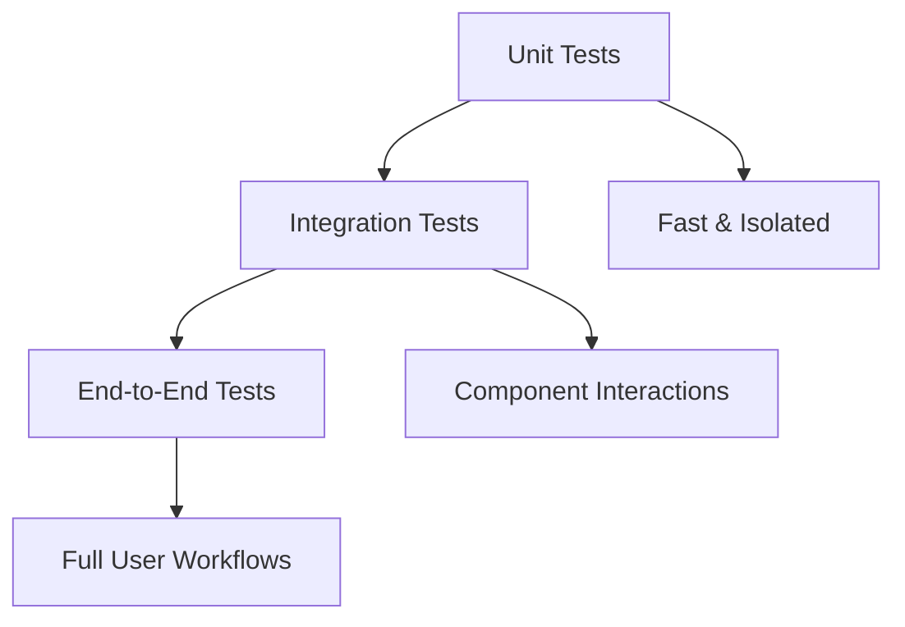

# Quick Start

This guide will help you get up and running with Hands testing tools in just a few minutes.

## Overview

Hands provides a comprehensive collection of testing tools and methodologies. Let's explore the key concepts and get you started with your first testing setup.

## Basic Concepts

### Testing Pyramid

Understanding the testing pyramid is crucial for effective test strategy:



### Key Principles

1. **Fast Feedback**: Tests should run quickly to provide immediate feedback
2. **Reliability**: Tests should be deterministic and not flaky
3. **Maintainability**: Tests should be easy to understand and update
4. **Coverage**: Tests should cover critical functionality appropriately

## Your First Test

Let's create a simple test to get started:

```python
# test_example.py
import pytest

def add(a, b):
    """Simple addition function"""
    return a + b

def test_add():
    """Test the add function"""
    assert add(2, 3) == 5
    assert add(-1, 1) == 0
    assert add(0, 0) == 0

def test_add_types():
    """Test add function with different types"""
    assert add(1.5, 2.5) == 4.0
    assert add("hello", " world") == "hello world"
```

Run the test:

```bash
pytest test_example.py -v
```

## Exploring the Tools

Now that you have a basic test running, explore our comprehensive tool coverage:

- **[Unit Testing](../tools/unit-testing.md)**: Frameworks like pytest, unittest
- **[Integration Testing](../tools/integration-testing.md)**: API testing, database testing
- **[End-to-End Testing](../tools/e2e-testing.md)**: Browser automation, full workflow testing

## Best Practices to Follow

1. **Write tests first** (Test-Driven Development)
2. **Keep tests small and focused**
3. **Use descriptive test names**
4. **Arrange, Act, Assert** pattern
5. **Mock external dependencies**

## Next Steps

- Explore [Testing Tools](../tools/overview.md) for comprehensive coverage
- Read [Best Practices](../best-practices/strategy.md) for advanced strategies
- Check the [Reference](../reference/api.md) for detailed documentation

!!! success "You're Ready!"
    You now have a solid foundation to start building robust test suites. Happy testing!