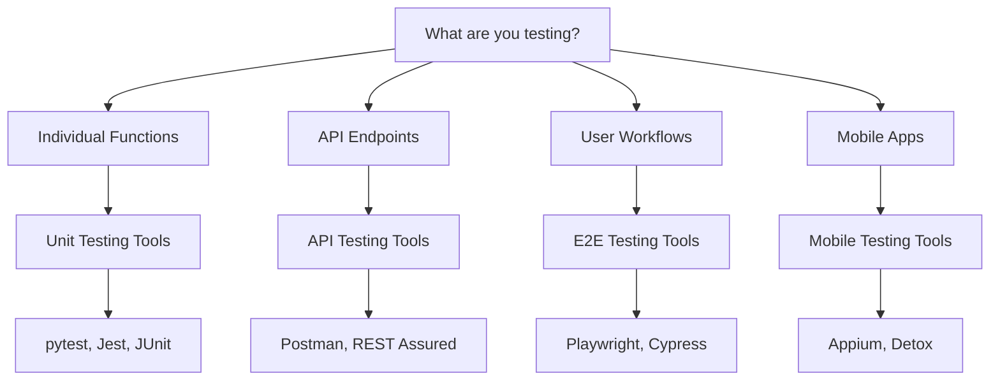

# Testing Tools Overview

This section provides a comprehensive overview of testing tools available across different categories and programming languages.

## Tool Categories

### Unit Testing Frameworks

Unit testing forms the foundation of any good test strategy. These tools help you test individual components in isolation.

| Tool | Language | Description | Popularity |
|------|----------|-------------|------------|
| pytest | Python | Feature-rich testing framework | ⭐⭐⭐⭐⭐ |
| Jest | JavaScript | Delightful JavaScript testing | ⭐⭐⭐⭐⭐ |
| JUnit | Java | Standard Java testing framework | ⭐⭐⭐⭐⭐ |
| NUnit | C# | Unit testing for .NET | ⭐⭐⭐⭐ |
| RSpec | Ruby | Behavior-driven development | ⭐⭐⭐⭐ |

### Integration Testing Tools

These tools help test how different components work together.

| Tool | Purpose | Best For |
|------|---------|----------|
| Postman | API Testing | REST API validation |
| TestContainers | Database Testing | Integration with databases |
| WireMock | Service Mocking | API mocking and stubbing |
| Docker Compose | Environment Setup | Multi-service testing |

### End-to-End Testing Solutions

Full workflow testing that simulates real user interactions.

| Tool | Type | Platform Support |
|------|------|------------------|
| Playwright | Browser Automation | Cross-browser |
| Cypress | Browser Testing | Modern web apps |
| Selenium | Web Testing | Multi-browser |
| Appium | Mobile Testing | iOS/Android |

## Choosing the Right Tools

### Decision Matrix

### Factors to Consider

1. **Team Expertise**: Choose tools your team can effectively use
2. **Technology Stack**: Align with your development languages
3. **Maintenance Cost**: Consider long-term maintenance requirements
4. **Integration**: How well does it fit with your CI/CD pipeline?
5. **Community Support**: Active community for help and resources

## Getting Started Recommendations

### For New Projects

1. Start with **unit testing** using your language's popular framework
2. Add **API testing** for backend services
3. Implement **E2E tests** for critical user journeys
4. Gradually expand coverage based on risk assessment

### For Existing Projects

1. **Audit current testing**: Identify gaps in coverage
2. **Prioritize high-risk areas**: Focus on critical business logic
3. **Add tests incrementally**: Don't try to achieve 100% coverage immediately
4. **Refactor as needed**: Improve testability of existing code

## Tool Comparison Guide

### Detailed Comparisons

- **[Unit Testing](unit-testing.md)**: In-depth comparison of unit testing frameworks
- **[Integration Testing](integration-testing.md)**: API and service testing tools
- **[End-to-End Testing](e2e-testing.md)**: Browser and workflow automation

!!! tip "Start Simple"
    Don't try to implement all testing types at once. Start with unit tests and gradually expand your testing strategy.